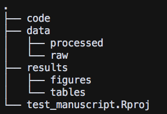
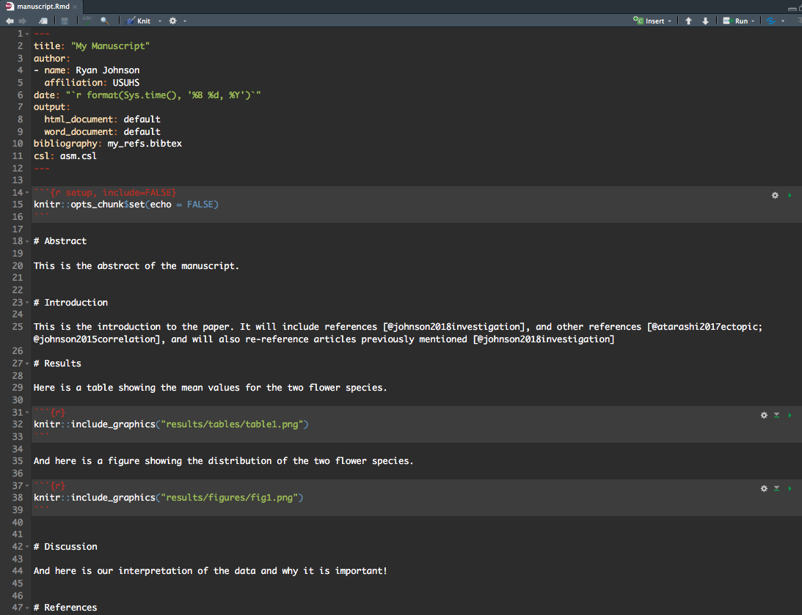
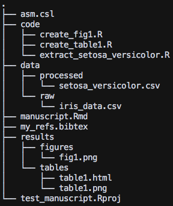
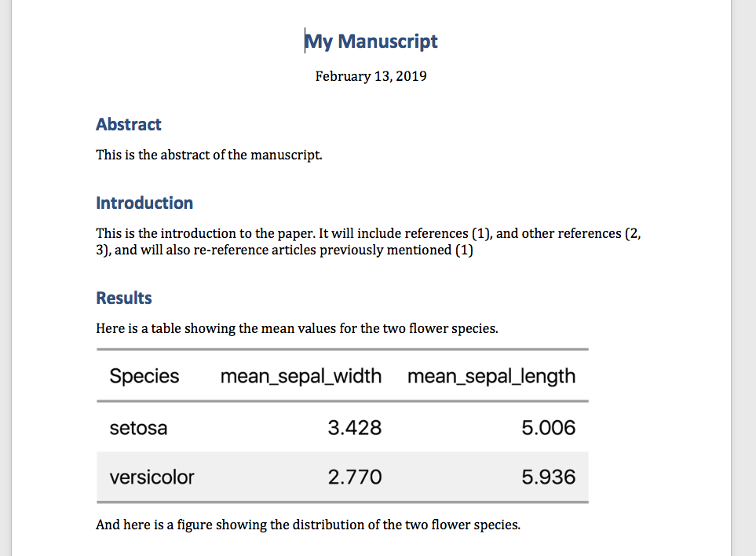
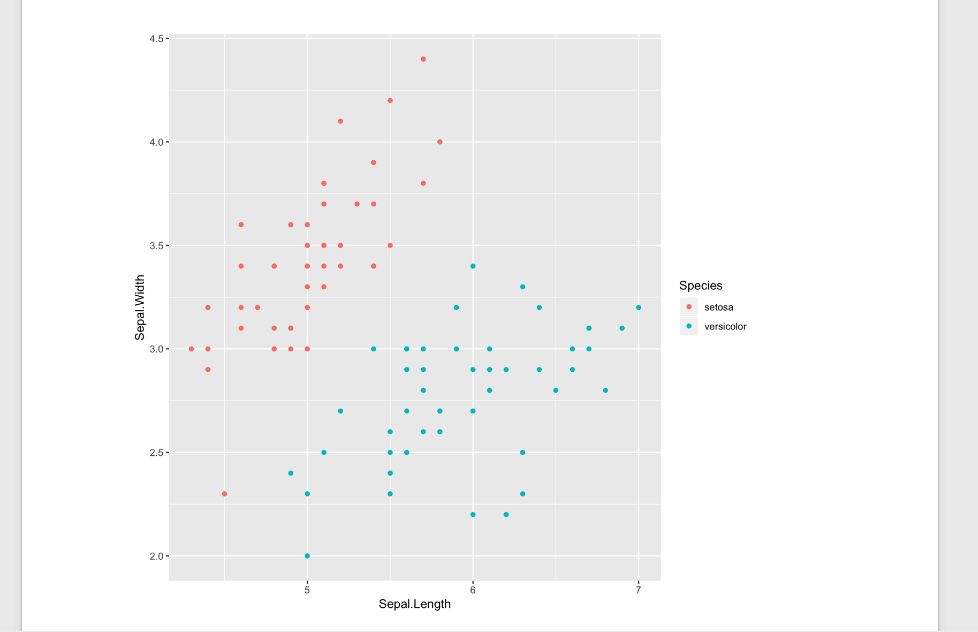
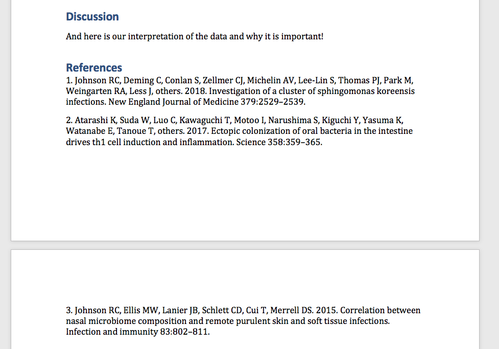
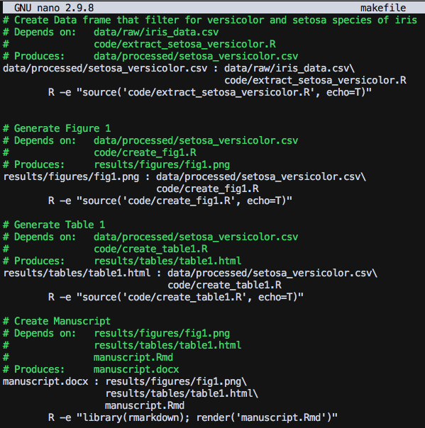
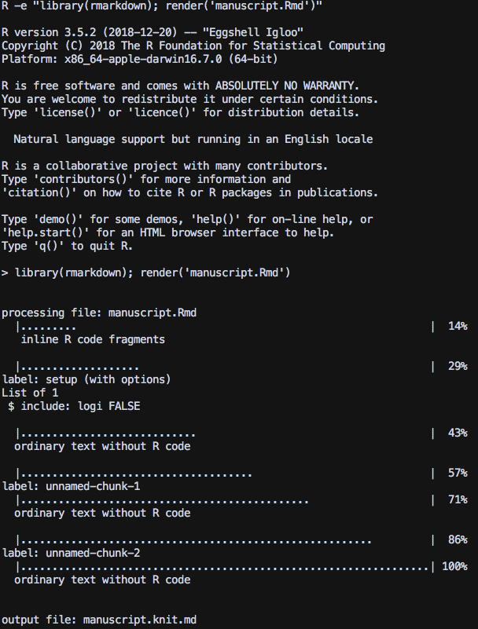

```{r, include=FALSE}
library(emo)
```

I'm gearing up to write a scientific manuscript and I want to try Rmarkdown for this. I've never used anything but Microsoft Word to write my manuscripts, and EndNote to manage my references. While I'm excited to try this out, I think the biggest challenge is going to be sharing my drafts with collaborators so that they can make edits (typically with *track changes* in microsoft word). Here are some of the key points that need to be addressed as I start researching methods for drafting manuscripts in Rmarkdown:

* **Needs to be reproducible.** This is a given since I will be generating the manuscript using code, but I want to explore all the ways in which I can make elements of the paper reproducible/automated including table/figure generation, in-line code chunks, formatting, etc.

* **Needs to have an output compatable with Microsoft Word**. While I don't necessarily like this point, it's a must as 99.99% of my collaborators will not know how to make edits to a Rmarkdown doc. Additionally, the *track changes* feature in word is the go-to for most scientists.

* **An efficient and flexible reference manager**. I know this is possible, just not aware of all the options currently available. Needs to be able to switch formats depending on the journal.


* **No major dependencies on LaTex.** This is a personal limitation as my work computer does not have admin rights, so I can't install MacTex or Latex. But I think I can get away without using it...but I suppose we'll find out `r emo::ji("grimacing")`.


# Setting up the File Structure

I first created a new directory on my desktop, and within it I created a new R project called `test_manuscript.Rproj`.

Then I want to have a few subdirectories here. Once I will call `/data` and within it I will have `/data/processed` and `/data/raw`. The **raw** directory will contain the primary data files and once they have been cleaned/fixed up and are ready to be analyzed, I will place them into the **processed** directory. Each processing step should have a script associated with it. So let's also creat a `code/` directory.

Now while I do like that ability to place code directly into the manuscript, I actually prefer to have separate scripts that do this, and place the resulting figures in a spearate directory. So let's create a `/results` directory, and within it we can have `/results/figures` and `/results/tables`.

Here is what my directory now looks like:



# The Data

As a mock example, I will use the data from the `iris` data set. I ran the following command just to get an actual csv file into the `data/raw` directory:

```{r eval=FALSE}
library(tidyverse)
write_csv(x = iris, path = "data/raw/iris_data.csv")
```

Now this data is already pretty clean, but just to demonstrate what I imagine my typical workflow would be...let's create a script and place it in the `code/` directory that will analyze the iris data and spit out a new csv file that will be placed into the `data/processed` directory. Here is the script:

```
# Name: extract_setosa_versicolor.R
# Author: Ryan Johnson
# Date created: 12 February 2019
# Purpose: Extract the Setosa and Versicolor species
#   of flowers from the iris_data.csv data

library(tidyverse)

## Read in Data ------------------------
iris_data <- read_csv("data/raw/iris_data.csv")

## Select Setosa and Versicolor -------------
iris_select <- iris_data %>% 
  filter(Species %in% c("setosa", "versicolor"))

## Write to processed
write_csv(x = iris_select,
          path = "data/processed/setosa_versicolor.csv")
```

Let's now make a dummy table. Unfortunately, this is going to be the hardest part to automate. I've tried a bunch of ways to get nice png image of tables, but for right now I will generage scripts that produce html files. I'll have to manually open them up and save them as screen shots. Kinda stinks but it's not like I will have hundreds of tables...likely just a handful. I know there are packages out there (like `gt`...which I like to use) that is working on implementing png exportable tables.

```
# Name: create_table1.R
# Author: Ryan Johnson
# Date: 12 February 2019
# Purpose: Generate table 1

library(tidyverse)
library(gt)
library(htmltools)


## Read in data -----------------------------------------------
iris_select <- read_csv("data/processed/setosa_versicolor.csv")


## Generate gt table ------------------------------------------
table_1 <- iris_select %>% 
  group_by(Species) %>% 
  summarise(mean_sepal_width = mean(Sepal.Width),
            mean_sepal_length = mean(Sepal.Length)) %>% 
  gt() %>% 
  as_raw_html(inline_css = TRUE)


## Export table into results/tables ---------------------------
write_file(table_1, "results/tables/table1.html")
```
And finally let's make a dummy figure.
 
```
# Name: create_fig1.R
# Author: Ryan Johnson
# Date: 12 February 2019
# Purpose: Generate figure 1

library(tidyverse)

## Read in data -----------------------------------------------
iris_select <- read_csv("data/processed/setosa_versicolor.csv")


## Create Figure -----------------------------------------------
iris_plot <- ggplot(data = iris_select, aes(x = Sepal.Length, y = Sepal.Width)) +
  geom_point(aes(color = Species))


## Save Plot -----------------------------------------------
ggsave(plot = iris_plot, filename = "results/figures/fig1.png")
```


# The Manuscript

After doing a bit of research, here is a bare-bones manuscript Rmarkdown file that I think will satisfy my needs:



Much of this may seem self-explanatory, but some stuff not so much. So first, let's understand what I did for references...

# Adding References

And now for a part that can be very complicated...adding references. It seems to me that the best way to organize your references is to place them into a **BibTex** document. I've pulled a few of my own papers from google scholar and converted them to BibTex format by selecting them and then exporting as BibTex:


I then saved the resulting file as `my_refs.bibtex`:

```
@article{johnson2015correlation,
  title={Correlation between nasal microbiome composition and remote purulent skin and soft tissue infections},
  author={Johnson, Ryan C and Ellis, Michael W and Lanier, Jeffrey B and Schlett, Carey D and Cui, Tianyuan and Merrell, D Scott},
  journal={Infection and immunity},
  volume={83},
  number={2},
  pages={802--811},
  year={2015},
  publisher={American Society for Microbiology Journals}
}

@article{atarashi2017ectopic,
  title={Ectopic colonization of oral bacteria in the intestine drives TH1 cell induction and inflammation},
  author={Atarashi, Koji and Suda, Wataru and Luo, Chengwei and Kawaguchi, Takaaki and Motoo, Iori and Narushima, Seiko and Kiguchi, Yuya and Yasuma, Keiko and Watanabe, Eiichiro and Tanoue, Takeshi and others},
  journal={Science},
  volume={358},
  number={6361},
  pages={359--365},
  year={2017},
  publisher={American Association for the Advancement of Science}
}

@article{johnson2018investigation,
  title={Investigation of a Cluster of Sphingomonas koreensis Infections},
  author={Johnson, Ryan C and Deming, Clay and Conlan, Sean and Zellmer, Caroline J and Michelin, Angela V and Lee-Lin, ShihQueen and Thomas, Pamela J and Park, Morgan and Weingarten, Rebecca A and Less, John and others},
  journal={New England Journal of Medicine},
  volume={379},
  number={26},
  pages={2529--2539},
  year={2018},
  publisher={Mass Medical Soc}
}
```
I also had to add a **csi style** to tell R how to format the references. I copied the **American Society for Microbiology** style from [this website](https://github.com/citation-style-language/styles), and saved it as `asm.csi`. Then in my yaml header (the top portion of the manuscript within the two ---), you need to tell R what bibtex library to use, and what style using the `bibliography` and `csi` arguments. You can then reference any article using the notation you see in the manuscript --> [@johnson2015correlation]

# Referencing Figures and Tables

This is pretty straightforward, feed the path to your png image to the `knitr::include_graphics("path/to/figure.png")`. I opted for this method rather than the `` as, I was told, it provide more flexibility...but for now, it works and looks pretty good.

# Generate Manuscript

Now, this is what my directory now looks like:



To publish the manuscript to a word document, click on arrow next to the `knitr` button and select `Knit to Word`. This will create a word document of your final manuscript! Mine looks like this:








# Automating with makefile

So the last thing I want to talk about is making everything automated...so that basically all I have to do is type `make paper` and all of the necessary code is re-run to make everything up to date and produce a finished paper.

If you're not familiar with makefiles (and I'm very much a novice), Pat Schloss has an entire youtube series on [reproducible research and covers makefiles for beginners](http://www.riffomonas.org/reproducible_research/)...and it's where I got started! 

I created a file called `makefile` and placed it in my main directory. Here is what mine looks like:



Key points with makefile:

* Be sure each R command is indented with a TAB

* Each rule is formated as `Target : Dependency`. If you have multiple dependencies, break them up line by line and be sure that each one (except for the last one) ends with a `\`.

Then, once your in your home directory, you can open the terminal and type `make manuscript.docx`. If all runs smoothly you should see this in your console:



Now here is the cool part...if you make any changes to say the code for figure 1, or code for table 1...or ANY dependency for the manuscript, the make command will rerun that code and make sure it's up to date and then will generate a new manuscript for you!

Hope this helps...as it really helped me get up and running with writing a manuscript in Rmarkdown. There are still tons of thing you can do to customize your document, but this should get you up and running!